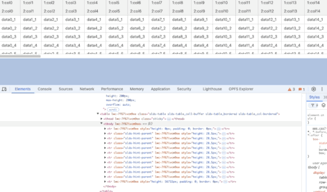

# (Sample) Virtual Scroll Table for Lightning Web Component

## Image

## Source Code

- force-app/main/default/lwc/virtualScrollTable

> [!NOTE]
> Note that the tbody rendering for virtual scrolling requires customization in virtualScrollTable.html. Source code is located in force-app/main/default/lwc/virtualScrollTable.

